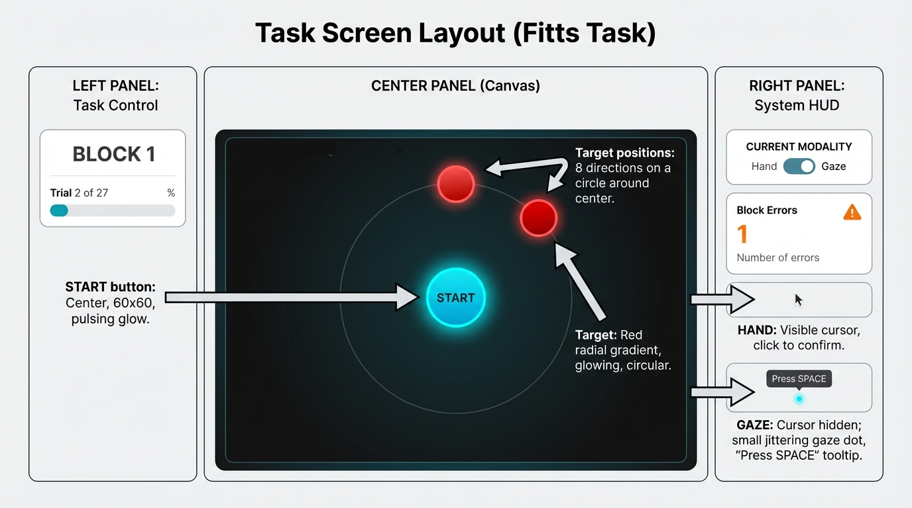
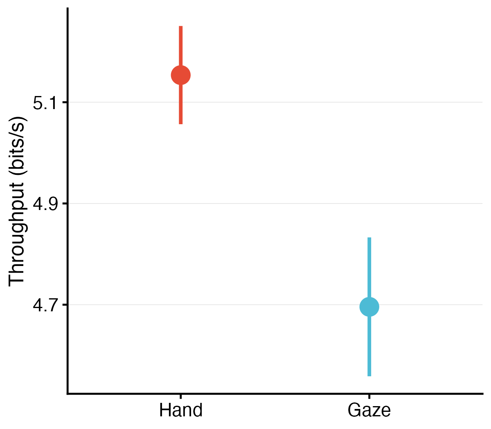
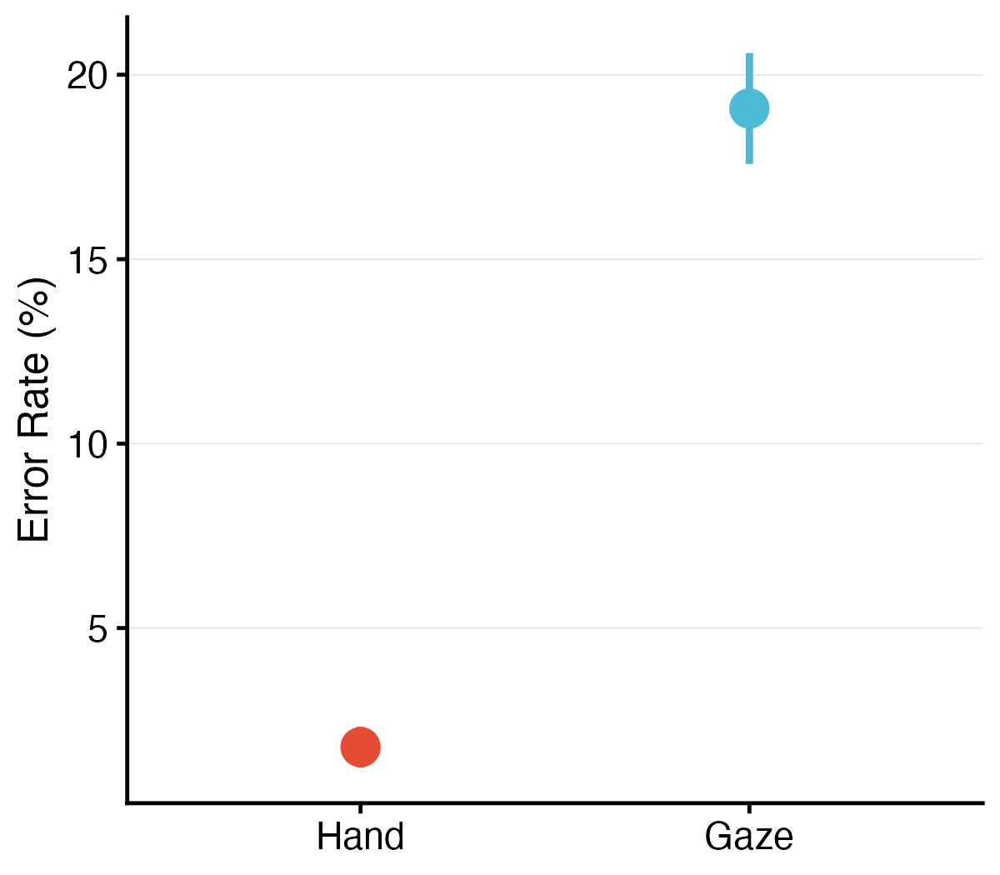
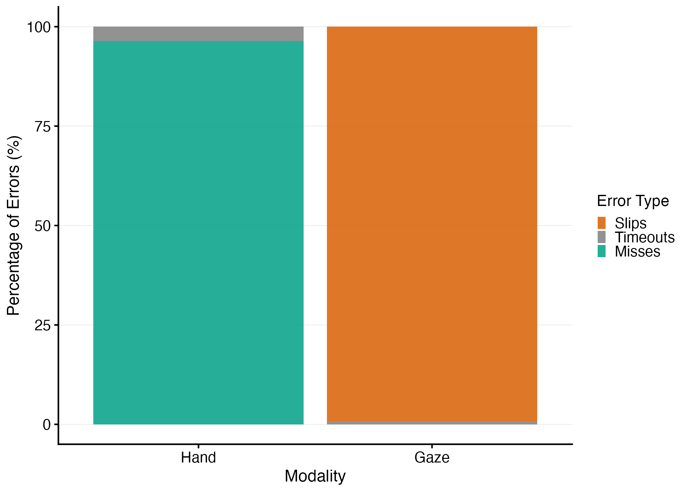
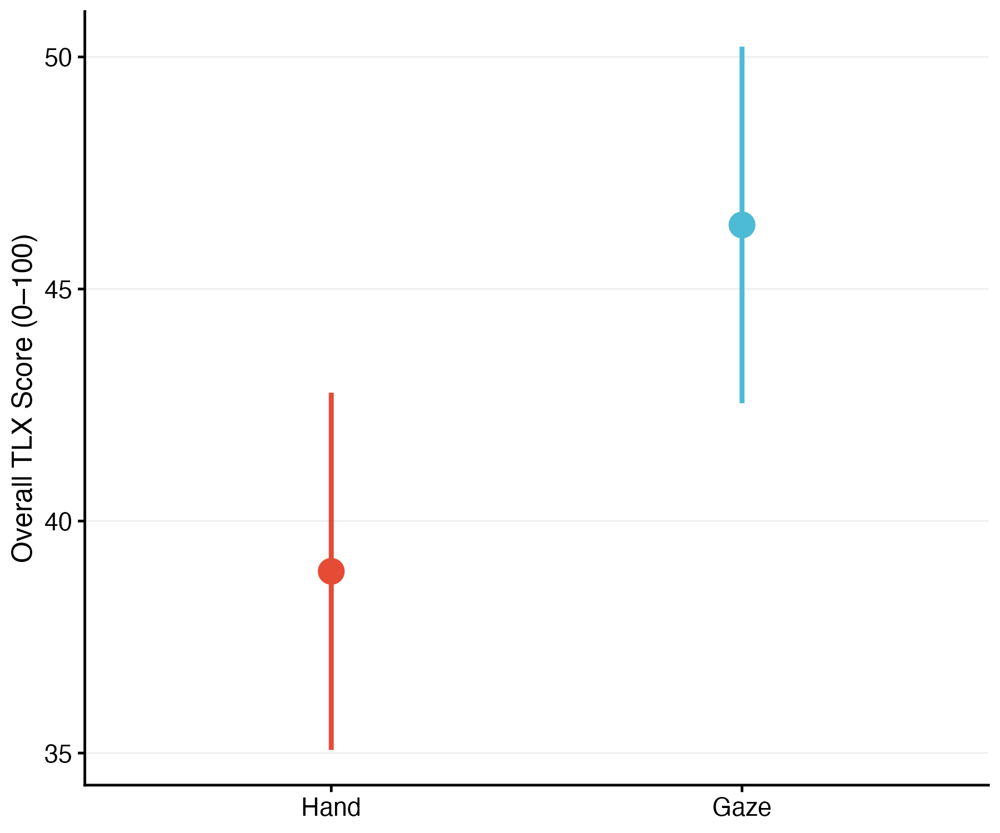
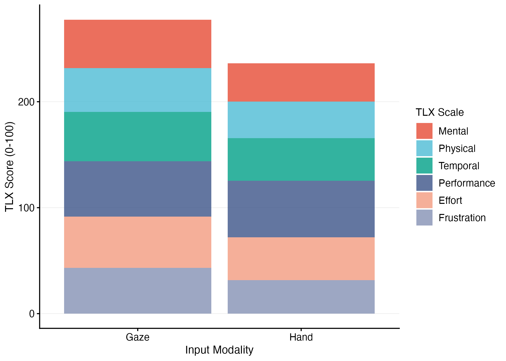
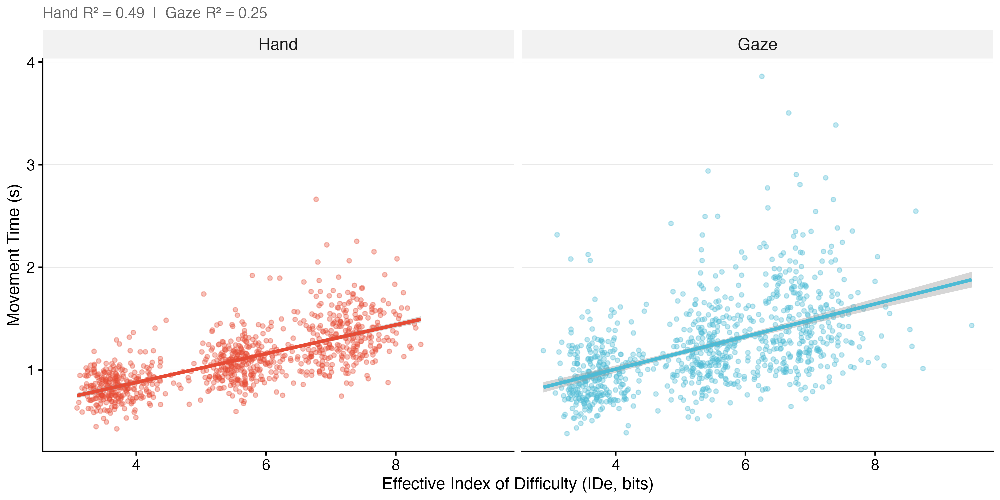

\vspace{-0.5em}

**Keywords:** Extended Reality, Adaptive Interfaces, Gaze Interaction, Fitts's Law, Multimodal Interaction, Gaze Simulation

\newpage

# Introduction

XR interaction changes the control demands of pointing by moving input from desktop devices to embodied hand and gaze actions. Unlike the desktop metaphor, where interaction is mediated by low-effort devices like the mouse and keyboard, XR requires the user to engage their entire body; the primary pointing devices are the user's own hands and eyes. This embodied interaction is fraught with ergonomic and cognitive challenges. The "Gorilla Arm" syndrome, a phenomenon where prolonged mid-air arm extension leads to rapid musculoskeletal fatigue and pain, remains a critical barrier to the long-term adoption of gestural interfaces. Conversely, gaze-based interaction, which leverages the speed of the human oculomotor system, suffers from the "Midas Touch" problem—the inherent ambiguity between looking for perception and looking for action—and lacks the fine motor precision required for granular manipulation tasks [@jacob1990eye].

Current XR systems typically force a binary choice: the user must either commit to a controller-based paradigm, accepting the physical fatigue, or a gaze-based paradigm, accepting the lack of precision and the potential for inadvertent triggers. This rigid dichotomy ignores the dynamic nature of human attention and the varying demands of different tasks. A high-precision manipulation task may require the stability of a hand controller, while a rapid visual search task is best served by the saccadic speed of the eye.

We introduce the xr-adaptive-modality-2025 platform, a research framework for studying adaptive switching between hand and gaze input in XR. The system combines an ISO 9241-9 pointing task, physiologically informed gaze simulation, and modality-specific adaptive interventions intended to address distraction during gaze selection and spatial difficulty during hand selection. The central question is whether adaptive modality logic can improve performance and workload relative to static unimodal interaction [@soukoreff2004towards].

# Background and Related Work

## The Sensorimotor Implications of Spatial Input

To design an effective adaptive system, one must first deconstruct the physiological mechanisms of the component modalities. Hand and gaze afford different control properties in XR: hand input supports precise corrective control, whereas gaze supports rapid orienting but introduces ambiguity when fixation is used for selection.

**Manual Pointing in XR:** Manual input in XR, whether through held controllers or optical hand tracking, mimics the act of physical pointing. This interaction style benefits from proprioception—the body's innate sense of limb position—which allows for high-precision corrections without visual attention. However, the biomechanical cost is substantial. In a 1:1 mapped XR environment, reaching a virtual object requires a corresponding physical motion. Frequent large-amplitude movements lead to fatigue in the deltoids and trapezius muscles. As fatigue sets in, the signal-to-noise ratio of the motor system degrades; the hand begins to tremor, increasing the effective target width required for accurate selection and reducing the overall throughput of the interaction.

**Gaze Interaction:** The eye is the fastest motor organ in the human body. Saccades—rapid, ballistic movements of the eye—can reach velocities exceeding 900 degrees per second [@bahill1979], making gaze an incredibly efficient modality for target acquisition. However, the eye is fundamentally an input organ, not an output device. Using gaze for selection introduces several critical issues: (1) **The Midas Touch**—in the physical world, we can look at an object without interacting with it, but in a gaze-controlled interface, looking becomes equivalent to touching, requiring "dwell time" mechanisms that slow interaction [@jacob1990eye]; (2) **Microsaccades and Jitter**—even when "fixated," the eye performs microsaccades to refresh the retinal image [@martinezconde2004], meaning a gaze cursor is inherently noisy, making selection of small targets frustrating without smoothing algorithms; (3) **Saccadic Suppression**—during rapid eye movements, the visual system suppresses input to prevent motion blur [@bridgeman1975], creating a "blind" phase that makes the initial phase of gaze targeting effectively open-loop.

## Signal Processing and Cognitive Load Theory

To study these dynamics controllably, our platform employs a generative simulation rather than raw sensor input. This simulation introduces three key constraints derived from oculomotor physiology: (1) **Sensor Lag**—a first-order lag (linear interpolation) mimics the processing latency (30–70 ms) typical of video-based eye trackers [@saunders2014]; (2) **Saccadic Blindness**—the cursor is frozen during high-velocity movements (\>120 deg/s), simulating the lack of visual feedback during a saccade [@bridgeman1975]; (3) **Fixation Jitter**—Gaussian noise is injected at low velocities to mimic fixational drift and tremor [@martinezconde2004], ensuring that the "cost" of gaze interaction is accurately represented even when using a mouse proxy.

We use Cognitive Load Theory (CLT) as a conceptual lens for reasoning about modality-specific costs [@hart2006nasa]. In principle, hand input may increase physical effort during larger reaches, whereas gaze input may increase extraneous attentional and verification demands during precise selection. The present study uses workload and performance measures to test whether those costs appear in the current task.

## Adaptive Intervention Mechanisms

We implemented two modality-specific adaptive interventions. **For gaze interaction**, a declutter mechanism draws on visual attention guiding techniques in XR, related to diminished reality (DR) [@herling2010]. When the policy engine detects performance degradation in gaze mode (error burst or RT threshold exceeded), non-critical HUD elements are hidden, mitigating peripheral distraction. This aligns with foveated rendering principles, where systems leverage the human visual system's foveal focus to prioritize content [@patney2016]. By decluttering when performance degrades, we hypothesize that gaze-based targeting becomes faster and less cognitively demanding.

**For hand-based interactions**, our adaptive strategy is width inflation—dynamically expanding the effective size of targets when performance degrades, triggered by the policy engine based on error rate and reaction time thresholds. This concept is inspired by "expanding targets" research [@mcguffin2005] and the "Bubble Cursor" [@grossman2005bubble], which demonstrate that even slight enlargement significantly improves pointing performance. Our implementation uses a hysteresis gate (requiring N consecutive trials meeting trigger conditions) to prevent flicker, acting as a "safety net" that compensates for motor tremor under fatigue. In the current interim dataset, the hand width-inflation pathway was not evaluable: width scaling remained at 1.0 across trials, and although the policy engine emitted inflate-width actions in some sessions, the rendered targets were not updated.

# Research Objectives

The primary objective of this research is to validate the efficacy of the `xr-adaptive-modality-2025` platform. The study is guided by three core research questions:

**RQ1 (Performance):** Does a context-aware adaptive system yield higher throughput ($TP$) than static unimodal systems?

**RQ2 (Workload):** Can adaptive modality switching reduce "Physical Demand" and "Frustration" (NASA-TLX) compared to traditional interaction?

**RQ3 (Adaptation):** Do adaptive interventions (declutter, width inflation) improve performance and reduce workload relative to non-adaptive conditions?

# Theoretical Framework

This section establishes the mathematical and psychological models that underpin the system's logic, specifically focusing on Information Theory as applied to human movement and the neuroergonomics of attention.

## Fitts's Law: The Information Capacity of the Human Motor System

Fitts's Law (1954) is robustly established as the governing dynamic of pointing tasks. It frames movement not as a physical event, but as an information transmission task. The "difficulty" of a target is measured in bits, representing the amount of information the motor system must process to resolve the movement successfully. We adopt the **Shannon Formulation**, the standard for ISO 9241-9 compliance, as it better models the information entropy of the task and avoids negative ID values for very close targets:

$$ID = \log_2 \left( \frac{D}{W} + 1 \right)$$

Movement Time ($MT$) is then modeled as a linear function of this difficulty:

$$MT = a + b \cdot ID$$

Where the intercept $a$ represents non-informational additive components (e.g., reaction time, system latency) and the slope $b$ represents the rate of information processing. The reciprocal of the slope, $1/b$, is often referred to as the **Index of Performance (**$IP$), or bandwidth, measured in bits per second.

## The Speed-Accuracy Tradeoff in 3D

In XR, the "Width" ($W$) of a target is ambiguous. To standardize performance across users with varying error rates, the `xr-adaptive-modality-2025` platform utilizes the **Effective Width (**$W_e$). Unlike nominal width, $W_e$ is derived from the spatial distribution of selection endpoints.

Consistent with ISO 9241-9, we calculate $W_e$ using the standard deviation of selection coordinates projected onto the task axis. For a target at position $P_{target}$ and a starting position $P_{start}$, the task axis vector is $\vec{v} = P_{target} - P_{start}$. The projected error $x_i$ for a trial $i$ with endpoint $P_{hit}$ is computed as the scalar projection:

$$x_i = \frac{(P_{hit} - P_{target}) \cdot \vec{v}}{\| \vec{v} \|}$$

The effective width is then calculated as $W_e = 4.133 \times \sigma_x$, where $\sigma_x$ is the standard deviation of these projected errors. This effectively normalizes the error rate to 4%, allowing us to calculate **Throughput (**$TP$), a unified metric of speed and accuracy:

$$TP = \frac{ID_e}{MT} = \frac{\log_2(D/W_e + 1)}{MT}$$

This metric is critical for comparing Modality A (Gaze) vs. Modality B (Hand). Gaze might have a lower $MT$ due to saccadic speed, but if its jitter results in a massive $W_e$ (low accuracy), the overall Throughput will be lower.

## Modeling Movement and Decision Processes

To decompose the underlying processes of movement execution and decision verification, we employ a **Hybrid Analysis Framework** that separates the ballistic trajectory from the final selection decision.

### Control Theory and Submovement Models

The **Optimized Submovement Model** [@meyer1988] posits that pointing movements are composed of a primary ballistic impulse followed by $n$ corrective submovements. The total movement time is the sum of the primary movement duration and the duration of subsequent corrections required to bring the endpoint error within the target bounds.

We quantify the "cost of control" by analyzing the velocity profile $v(t)$ of the cursor. A submovement is mathematically identified as a zero-crossing in the acceleration profile (or a local maximum in velocity) after the initial ballistic phase. The **Submovement Count (**$N_{sub}$) serves as a proxy for the efficiency of the control loop:

$$N_{sub} = \sum_{t=0}^{T} \mathbb{1}(\text{is\_velocity\_peak}(t)) - 1$$

In gaze-based interaction, simulated lag and saccadic blindness force users into an intermittent control regime, theoretically increasing $N_{sub}$. Submovement and path-quality analyses are part of the broader pipeline and will be reported in the full confirmatory sample.

### The Linear Ballistic Accumulator (LBA) Model

Once the cursor enters the target, users face a decision verification problem: "Is the cursor stable enough to click?" We model this using the **Linear Ballistic Accumulator (LBA)** [@brown2008]. LBA treats the decision as a race between independent accumulators (e.g., "Select" vs. "Wait/Drift").

For the $i$-th accumulator, evidence $x_i(t)$ accumulates linearly over time $t$ from a starting point $A$ with a drift rate $d_i$:

$$x_i(t) = A + d_i \cdot t$$

The starting point $A$ is drawn from a uniform distribution $U[0, A_{max}]$, and the drift rate $d_i$ is drawn from a normal distribution $N(v_i, s)$. A decision is made when the evidence reaches a threshold $b$.

Unlike Drift Diffusion Models (DDM) which require substantial error rates to constrain the boundary separation [@lerche2017], LBA is robust to the low-error scenarios typical of Fitts' tasks. It allows us to explicitly estimate the **Caution Threshold (**$b - A$)—the amount of evidence users require before committing to selection. We hypothesize that adaptive interventions can alter the amount of evidence users require before committing to selection.

# Methods

The study was designed to support reproducible evaluation of adaptive modality switching under controlled remote testing conditions. The platform `xr-adaptive-modality-2025` serves as the technical apparatus for the study.

## Apparatus and Participants

We developed a custom pointing testbed as a web-based application (React 18, TypeScript), allowing broad hardware compatibility for remote participants. The study was conducted on participants' own computers using a standard mouse or trackpad.

### Display Calibration and Reliability Measures

To ensure measurement validity across heterogeneous display configurations, we implemented a multi-layered approach addressing display variability. Before commencing experimental trials, participants completed a **Credit Card Calibration** procedure: participants placed a standard credit card (85.60 mm × 53.98 mm) on their screen and adjusted an on-screen rectangle to match its physical dimensions. This calibration enabled computation of pixels per millimeter (px/mm) and pixels per degree of visual angle (PPD), normalizing gaze simulation jitter to screen-space pixels and ensuring consistent perceptual difficulty across different display sizes and resolutions [@mackenzie1992fitts].

To minimize measurement error, we enforced strict display requirements: fullscreen/maximized window (required before starting blocks), browser zoom locked to 100% (verified before each block using `window.visualViewport.scale`), and live monitoring during trials (trials automatically paused if settings changed). For every trial, we logged comprehensive display metadata: device pixel ratio (DPR), browser type, viewport dimensions, zoom level, fullscreen status, and tab visibility duration. Trials were excluded from analysis if zoom level ≠ 100%, fullscreen status = FALSE, DPR instability (change \> 0.1 between blocks), or tab hidden for \> 500ms. Participants with \>40% of trials excluded due to display violations were removed from the final analysis.

### Gaze Simulation (The "Ground Truth" Signal)

To ensure rigorous internal validity and precise control over noise characteristics, we utilized a **Physiologically-Accurate Gaze Simulation**. This approach allowed us to model the specific constraints of eye-tracking interaction—latency and jitter—with precise control over noise characteristics. The simulation transformed raw mouse input into "gaze" coordinates via three mechanisms derived from oculomotor physiology:

1.  **Saccadic Suppression & Ballistic Movement:** The cursor was "frozen" (blind) during high-velocity movements (\>120 deg/s) to simulate the brain's suppression of visual input during saccades, a phenomenon known as saccadic suppression of image displacement [@bridgeman1975]. This aligns with the ballistic nature of saccadic eye movements, where visual feedback is effectively open-loop until the eye settles.

2.  **Fixation Jitter & Drift:** When the cursor slowed (\<30 deg/s), Gaussian noise (SD ≈ 0.12° visual angle) was injected to simulate fixational eye movements [@martinezconde2004], specifically the random walk characteristics of ocular drift and tremor that occur even during attempted fixation. This angular noise was normalized to screen pixels using the pixels-per-degree (PPD) calibration value, ensuring consistent perceptual difficulty across different display sizes and viewing distances.

3.  **Sensor Lag:** A first-order lag (linear interpolation, factor 0.15) was applied to mimic the processing latency (typically 30–70 ms) inherent in video-based eye trackers [@saunders2014].

## Input Modality Implementations

The system implemented two distinct input modalities, each with static and adaptive modes. **For hand-based trials**, participants controlled a cursor with their mouse to click the target. In static mode, this was standard 1:1 mouse pointing. In adaptive mode, the system was designed to expand the effective clickable area of targets (width scale \> 1.0) through a rule-based policy engine that triggers when performance degrades (error burst ≥ 2 consecutive errors or reaction time exceeds the 75th percentile threshold), drawing on the "expanding targets" technique [@mcguffin2005]. In the current interim dataset, the hand width-inflation pathway was not evaluable: width scaling remained at 1.0 across trials, and although the policy engine emitted inflate-width actions in some sessions, the rendered targets were not updated.

**For gaze-based trials**, participants controlled the cursor via the simulated gaze signal described above. In the analyzed dataset, gaze selection used **500 ms dwell-to-select**: the cursor had to remain within the target for 500 ms to trigger selection automatically. Space key confirmation (dwell disabled) was not used. This follows the standard "dwell-to-select" paradigm [@ware1987; @majaranta2006]. In adaptive mode, the system implements a **declutter mechanism** that hides non-critical HUD elements when the policy engine detects performance degradation (error burst or RT threshold exceeded) in gaze blocks. The declutter effect persists until performance improves, using hysteresis to prevent rapid oscillation. Advanced gaze adaptations such as goal-aware snapping and dynamic dwell time adjustment are planned for future implementations.

Both adaptive features (declutter and width expansion) are driven by a rule-based policy engine with hysteresis gates (requiring N consecutive trials meeting trigger conditions) to prevent flicker. The application logged detailed event traces (policy state changes, trial performance, adaptation triggers) to enable verification of adaptive mechanism activation and effectiveness.

## Task and Stimuli

Participants performed a multi-directional pointing task conforming to the ISO 9241-9 standard for non-keyboard input device evaluation [@iso2000]. Targets were arranged in a circular layout with 8 positions (width $W$, amplitude $A$), with one target highlighted at a time. Targets were presented with IDs ranging from approximately 2 to 6 bits, calculated using the Shannon formulation of Fitts' Law (target width ranged from 30 px to 80 px, with corresponding distances chosen to yield the desired ID values). In half of the blocks, a "Time Pressure" condition was enforced via a visible countdown timer; failure to select within the timeout (6s) resulted in a forced error, intended to induce stress and mental workload, simulating a high-demand scenario. @fig-task-layout shows the task interface.

{#fig-task-layout width=85%}

## Experimental Design

We employed a repeated-measures factorial design: all participants experienced every combination of the two input modalities (Gaze vs. Hand) × two UI conditions (Adaptive vs. Non-adaptive) × two workload levels (Pressure vs. No Pressure). This creates a 2 × 2 × 2 within-subjects design.

### Counterbalancing: The Williams Design

The order of modality blocks was counterbalanced using a Williams Latin square arrangement to control for learning effects [@williams1949experimental]. Static and adaptive conditions were run as **separate blocks**; each block corresponded to one Modality × UI Mode combination (e.g., Hand-Static, Gaze-Adaptive). Within each block, all trials shared the same modality and UI mode. Participants were not explicitly told when the system was adapting, aside from noticing the visual changes, to reduce expectancy biases.

## Participants

### Sample Size and Recruitment

The planned confirmatory sample was N=48, corresponding to six complete Williams counterbalancing blocks. At the time of this interim report, the complete factorial dataset available for primary analysis included N=23 participants. Seven earlier participants were excluded from the primary 2×2×2 analysis because a pressure-logging bug misrecorded block condition; their data were retained only for exploratory use. Replacement recruitment is ongoing to restore the planned complete sample of N=48. Participants were recruited from the university community (target: balanced gender distribution, age range 18-35). All had normal or corrected-to-normal vision and no known motor impairments. The study was approved by the Institutional Review Board (IRB) and all participants provided informed consent.

## Procedure

Each participant completed a short training session to get familiar with gaze selection (including practice with the simulated gaze interface and dwell clicking) and hand selection. During the experiment, they performed 4 blocks of 40 trials each (160 trials total per participant). Practice trials (10 per modality before the main blocks) were excluded from analysis. Target positions cycled through 8 directions; Index of Difficulty varied across three levels (≈2–6 bits). Pressure (time-limited vs. self-paced) was varied within blocks.

After each block, participants filled out a NASA-TLX workload survey (rating mental demand, physical demand, etc.) and took a short break to mitigate fatigue. The entire session lasted about 1 hour per participant.

## Measures and Analysis Strategy

The primary performance measures were Movement Time (MT) in milliseconds (from trial start to successful selection) and Selection Accuracy (hit vs. miss rate, including specific error types: misses, timeouts, slips). From these, we computed Throughput (TP) in bits/second for each condition by combining each trial's effective ID ($ID_e$) and MT, following ISO 9241-9's recommended calculation using the effective target width $W_e$ (computed from the spread of hit points) to incorporate accuracy into the difficulty measure.

Because this manuscript reports an interim dataset, the main text emphasizes descriptive estimates and 95% confidence intervals for the currently available complete factorial sample. Confirmatory mixed-effects models, preregistered contrasts, and multiplicity-controlled follow-up tests will be reported after the target sample of N=48 is reached. We adopted a **Hybrid Analysis** framework to disentangle "motor" performance from "decision" caution: (1) **Macro-Performance (Fitts' Law)**—we modeled the overall throughput (bits/s) and the regression slope ($b$) to quantify the global cost of the gaze simulation lag, following standard ISO 9241-9 throughput calculations; (2) **Path Quality (Control Theory)**—we calculated pre-computed submovement counts (velocity peaks detected in real-time) and target re-entries to quantify the "cost of control," drawing on the Optimized Submovement Model [@meyer1988]; (3) **Decision Verification (LBA)**—we used the Linear Ballistic Accumulator (LBA) model [@brown2008] to analyze the verification phase (time from first target entry to final selection). LBA is robust to low error rates and allows estimation of non-decision time (NDT), drift rate, and decision threshold. We fit a hierarchical Bayesian LBA model in PyMC with modality- and UI-mode-varying NDT, ID-varying drift rate, and pressure-varying threshold. For the verification-phase component, we used LBA rather than DDM because the subset of trials used for that analysis did not provide error patterns suitable for stable DDM estimation [@lerche2017].

## Deployment and Data Collection Infrastructure

The experimental platform was deployed as a web application (React 18, TypeScript, Vite) hosted on Vercel (https://xr-adaptive-modality-2025.vercel.app) to enable remote, asynchronous data collection. Each participant received a unique URL containing embedded participant ID and session number parameters (e.g., `?pid=P001&session=1`). The application automatically detected these parameters on load, initializing the session with the appropriate identifier. Session state was managed client-side using browser localStorage, enabling participants to pause and resume sessions while maintaining progress tracking.

Data collection occurred entirely client-side to ensure participant privacy. The application implemented a structured CSV logging system that captured comprehensive trial-level data in real-time (77 columns per trial), including participant metadata (ID, demographics, session number), trial parameters (block, trial, modality, UI mode, pressure, ID, A, W), performance metrics (RT, accuracy, error type, hover duration, submovement count, verification time), adaptive system metrics (width scaling, alignment gate metrics, adaptation triggers), system metadata (browser type, DPR, display calibration, timestamp), and workload measures (NASA-TLX subscales). At the completion of each session, participants exported their data via browser-based CSV download. Data export occurred entirely locally—no data was transmitted to servers during the experimental session, ensuring participant privacy. The application was built as a single-page application (SPA) with client-side routing, with the gaze simulation algorithm, adaptive policy engine, and data logging system all operating in real-time within the browser. Event-driven architecture (via an internal event bus) coordinated trial timing, data logging, and UI updates, ensuring precise temporal alignment between user actions and recorded data.

**Data Quality Assurance:** A comprehensive audit was conducted on December 8, 2025, to verify data collection integrity. The audit confirmed that modality and UI mode conditions were logged correctly (0 mismatches across all participants). However, a bug was identified in the pressure condition logging that affected the first 7 participants (see Participant Exclusions above). The bug was fixed immediately, and all subsequent data collection used the corrected logging code. All code is open-source and available for reproducibility.

# Results

We report interim results from the current dataset (N=23 participants with complete factorial data). Full confirmatory analyses with mixed-effects models will be reported upon completion of the target sample (N=48).

## Primary Performance Outcomes (RQ1)

Throughput (TP), error rate, and movement time (MT) were computed following ISO 9241-9. @tbl-performance reports descriptive statistics by modality, collapsed over UI mode and pressure.

::: {#tbl-performance}
| Metric | Hand | Gaze |
|:-------|:----:|:----:|
| Throughput (bits/s) | 5.15 [5.06, 5.25] | 4.70 [4.56, 4.83] |
| Error Rate (%) | 1.75 [1.23, 2.26] | 18.65 [17.26, 20.04] |
| Movement Time (s) | 1.09 [1.07, 1.11] | 1.19 [1.16, 1.23] |

: Primary performance metrics by modality. Values are mean [95% CI]. Hand produced higher throughput and lower error rate than gaze.
:::

Hand input yielded higher throughput (5.15 vs. 4.70 bits/s) and substantially lower error rate (1.75% vs. 18.65%) than gaze input. Movement time was shorter for hand (1.09 s) than gaze (1.19 s). Descriptively, hand outperformed gaze on throughput and error rate in the current complete-case dataset. @fig-throughput and @fig-error-rate illustrate these differences.

{#fig-throughput width=70%}

{#fig-error-rate width=70%}

## Error Profile: Midas Touch Confirmation

Error types differed sharply between modalities (@tbl-error-types). For **gaze**, 99.2% of errors were **slips** (accidental activations) and 0.8% were timeouts. For **hand**, 95.7% were **misses** (target not acquired) and 4.3% were timeouts. This asymmetry provides empirical confirmation of the Midas Touch problem: gaze interaction fails primarily due to intent ambiguity (looking to see vs. looking to select), whereas hand interaction fails due to spatial targeting errors.

::: {#tbl-error-types}
| Error Type | Hand | Gaze |
|:-----------|:----:|:----:|
| Slip (accidental activation) | 0% | 99.2% |
| Miss (target not acquired) | 95.7% | 0% |
| Timeout | 4.3% | 0.8% |

: Distribution of error types by modality. Gaze errors are predominantly slips; hand errors are predominantly misses.
:::

@fig-error-types shows the composition of errors by modality, illustrating the stark contrast between gaze (slips) and hand (misses).

{#fig-error-types width=75%}

## Gaze Declutter Effectiveness (RQ3)

The gaze adaptive manipulation (declutter) was the only adaptation that executed in this dataset. Gaze error rate was modestly lower in adaptive (18.2%) than static (19.1%) mode. The declutter mechanism reduced timeouts (1.18% → 0.42%) but did not materially reduce slips (98.8% → 99.6%). Hand width inflation was not evaluable in the present dataset (width scaling remained at 1.0; see Appendix). At N=23, the declutter effect is directional; confirmatory tests will be reported at N=48.

## Subjective Workload (RQ2)

NASA-TLX scores (0–100) were higher for gaze than hand across all subscales (@tbl-tlx). Overall workload (unweighted mean of six subscales) was 40.4 [37.0, 43.8] for hand and 47.0 [43.9, 50.2] for gaze. For the RQ2-specified subscales, **Physical Demand** was 34.3 [30.8, 37.8] (hand) vs. 41.9 [38.4, 45.4] (gaze), and **Frustration** was 32.2 [28.5, 35.9] (hand) vs. 43.2 [39.5, 46.9] (gaze).

::: {#tbl-tlx}
| NASA-TLX Subscale | Hand | Gaze |
|:------------------|:----:|:----:|
| Mental Demand | 34.9 [31.5, 38.4] | 45.7 [42.4, 49.1] |
| Physical Demand | 34.3 [30.8, 37.8] | 41.9 [38.4, 45.4] |
| Temporal Demand | 40.3 [36.9, 43.6] | 47.1 [44.0, 50.1] |
| Performance | 55.6 [50.4, 60.9] | 53.3 [49.3, 57.3] |
| Effort | 39.8 [36.1, 43.5] | 48.6 [45.2, 51.9] |
| Frustration | 32.2 [28.5, 35.9] | 43.2 [39.5, 46.9] |
| **Overall** | **40.4 [37.0, 43.8]** | **47.0 [43.9, 50.2]** |

: NASA-TLX subscale means [95% CI] by modality. Higher = more workload.
:::

@fig-tlx shows overall workload by modality. @fig-tlx-stacked shows the subscale composition.

{#fig-tlx width=70%}

{#fig-tlx-stacked width=75%}

## LBA Cognitive Modeling

The LBA model decomposes verification-phase reaction time into latent cognitive components: **non-decision time** (NDT, encoding + motor execution), **drift rate** (information accumulation speed), and **decision threshold** (caution). We fit a hierarchical Bayesian LBA model in PyMC, with NDT varying by modality and UI mode, drift rate varying by Index of Difficulty (ID), and threshold varying by pressure condition. The model used verification-phase RTs (200–5000 ms) from valid trials. MCMC sampling used multiple chains with R-hat < 1.01 and ESS > 2,000 for all parameters, indicating convergence.

### Parameter Estimates

@tbl-lba-params reports group-level LBA parameter estimates by modality and UI mode. Non-decision time (t0) is the primary parameter that varies across conditions; drift and threshold parameters are shared across conditions with modality- and pressure-specific effects captured in the hierarchical structure.

::: {#tbl-lba-params}
| Condition | t0 (NDT) [95% HDI] | Drift Base | ID Slope [95% HDI] | Pressure Slope [95% HDI] |
|:---------|:-------------------:|:----------:|:-------------------:|:------------------------:|
| Hand – Static | −2.85 [−3.46, −2.24] | 5.03 | −0.93 [−0.95, −0.92] | 0.06 [0.03, 0.09] |
| Hand – Adaptive | −3.01 [−3.64, −2.42] | 5.03 | −0.93 [−0.95, −0.92] | 0.06 [0.03, 0.09] |
| Gaze – Static | −1.41 [−1.87, −1.00] | 5.03 | −0.93 [−0.95, −0.92] | 0.06 [0.03, 0.09] |
| Gaze – Adaptive | −0.97 [−1.39, −0.57] | 5.03 | −0.93 [−0.95, −0.92] | 0.06 [0.03, 0.09] |

: LBA parameter estimates by modality and UI mode. Point estimates with 95% highest-density intervals. t0 (latent): non-decision time; higher values indicate longer verification-phase duration. ID slope: effect of difficulty on drift (negative = harder trials reduce drift). Pressure slope: effect of time pressure on threshold. Drift base and threshold intercept shared across conditions.
:::

### Interpretation

**Modality effect on NDT:** Gaze conditions show higher t0 values (less negative: −1.41 to −0.97) than hand conditions (−3.01 to −2.85), consistent with a longer verification-phase duration for gaze interaction. The pattern is compatible with the Midas Touch account: gaze may require additional time for intent disambiguation before selection.

**UI mode effect:** Adaptive UI shows different t0 patterns, particularly for gaze (static: −1.41, adaptive: −0.97). The higher t0 in gaze-adaptive may reflect altered verification timing under declutter, though the direction warrants further investigation with the full sample.

**Difficulty and pressure:** The negative ID slope (−0.93) is consistent with harder trials reducing drift rate (Fitts's Law). The positive pressure slope (0.06) suggests a speed–accuracy tradeoff: higher time pressure increases the decision threshold.

### Convergence Diagnostics

@fig-lba-trace shows MCMC trace plots for key parameters. The drift-rate slope (ID) and threshold slope (pressure) exhibit unimodal posteriors and well-mixed chains. Non-decision time shows multiple modes across the four condition cells, reflecting the hierarchical structure; R-hat remained at 1.0 for all parameters, and ESS exceeded 2,000.

{#fig-lba-trace width=90%}

# Discussion

The interim results suggest a clear modality asymmetry in XR pointing performance. Across the primary performance measures, hand input outperformed gaze input: hand produced higher throughput (5.15 vs. 4.70 bits/s), lower error (1.75% vs. 18.65%), and shorter movement time (1.09 vs. 1.19 s). The workload pattern paralleled these performance differences. NASA-TLX scores were higher for gaze than hand overall (47.0 vs. 40.4), with especially notable differences in Physical Demand (41.9 vs. 34.3) and Frustration (43.2 vs. 32.2). Taken together, these interim findings address RQ1 and RQ2 in a consistent direction: under the present task and simulation conditions, gaze interaction was not merely less accurate than hand input, but also experienced as more effortful.

The most informative result is not only that gaze performed worse, but how it failed. Gaze errors were overwhelmingly slips (99.2%), whereas hand errors were overwhelmingly misses (95.7%). This asymmetry is important because it distinguishes two different failure regimes. Hand failures reflected spatial targeting difficulty: users attempted the correct action but failed to acquire the target. Gaze failures instead reflected intent ambiguity: the system registered activation when users were looking, but not necessarily intending to select. This pattern is directly consistent with the Midas Touch account proposed by Jacob [-@jacob1990eye]. In that sense, the present dataset contributes more than another hand-versus-gaze comparison. It shows that the principal liability of gaze in this XR task was not generic imprecision alone, but the coupling of visual attention and command execution.

These findings also fit the information-theoretic interpretation of pointing performance formalized by Fitts's Law [@soukoreff2004towards]. Throughput reflects the effective rate at which a user can resolve spatial uncertainty, expressed in bits per second. On that metric, hand preserved a higher information-processing rate than gaze in the current task. The appendix-level Fitts validation supports this interpretation: hand showed stronger fits and more stable scaling with index of difficulty, whereas gaze exhibited weaker fits and lower explained variance. Although both modalities were affected by task difficulty, the flatter and noisier gaze fits suggest that its performance was shaped by more than ballistic movement alone. In other words, increasing difficulty did not simply elongate transport time; it also appears to have amplified downstream verification demands.

The cognitive modeling results sharpen that interpretation. In the LBA analysis, gaze showed higher non-decision time than hand, indicating a longer pre- or post-decisional component surrounding overt selection [@brown2008]. In the present task, the most plausible interpretation is that gaze required a longer verification phase before commitment. That is exactly where a Midas Touch problem should appear: not necessarily in the initial orientation toward a target, but in the added delay needed to decide whether fixation is sufficiently stable, intentional, and safe to confirm. The negative ID slope for drift rate (−0.93) is also consistent with a Fitts-like account in which harder trials reduce the rate of evidence accumulation. The positive pressure slope (0.06) further suggests that time pressure altered the caution policy rather than simply speeding responses, which is consistent with a speed–accuracy tradeoff account. Taken together, the LBA results indicate that gaze interaction imposed a verification burden beyond raw target acquisition.

This pattern can also be understood through the lens of cognitive load. In principle, gaze offers a low-effort means of orienting to targets, while hand input incurs greater bodily effort, especially in spatial interfaces often associated with "Gorilla Arm" fatigue. Yet the present workload results suggest that, in this task, gaze introduced greater extraneous load than hand. That load likely came from the need to monitor cursor stability, manage dwell or confirmation timing, and suppress unintended selections. Hand input, by contrast, appears to have shifted the burden toward controlled spatial targeting, but in a way that remained more manageable under the current task constraints. In that sense, the gaze–hand tradeoff is not well captured by a simple speed-versus-fatigue dichotomy. Rather, gaze may reduce some motor demands while increasing decisional and attentional overhead; hand may require more overt motor control while preserving clearer action intention and lower ambiguity. The workload findings are consistent with that framing, particularly the elevated Frustration scores under gaze.

RQ3 received only partial support in this interim dataset. The only adaptive mechanism that actually executed was gaze declutter, and its benefit was modest. Gaze error declined directionally from 19.1% in the static condition to 18.2% in the adaptive condition. More specifically, declutter reduced timeouts from 1.18% to 0.42%, but did not reduce slips; slips remained dominant and even slightly increased proportionally (98.8% to 99.6%). This pattern suggests that declutter may have helped with distraction-driven hesitation or delayed commitment, but it did not address the core failure mode of gaze interaction, namely intent disambiguation. That distinction matters: if the main problem is that users accidentally activate while looking, reducing peripheral clutter may improve attentional focus without solving the actual selection ambiguity. By contrast, the hand width-inflation mechanism was not evaluable in the present dataset (width scaling remained at 1.0; the policy engine emitted actions in some sessions but the UI did not apply them to rendered targets). Any interpretation of RQ3 must therefore remain provisional until the full confirmatory sample is collected and both adaptation pathways are observed in operation.

The present findings are broadly aligned with prior work showing both the promise and fragility of gaze-based interaction in multimodal systems. Prior gaze+hand paradigms have often treated gaze as an efficient means of target acquisition and the hand as a confirmation or refinement channel, thereby exploiting the complementary strengths of the two modalities [@pfeuffer2017gaze]. That general logic is compatible with the current results: gaze appears efficient for orienting attention, but unreliable as a sole selection mechanism when intent must be inferred from fixation. Likewise, the width-inflation mechanism draws conceptually on expanding-target and Bubble Cursor work, which has repeatedly shown that increasing effective target size can improve pointing performance under uncertainty [@mcguffin2005; @grossman2005bubble]. A key contribution of the present platform is the integration of physiologically constrained gaze simulation, an ISO 9241-9 task structure, and policy-driven adaptive modality logic within one reproducible framework. That combination makes it possible to study modality-specific failure modes under controlled conditions rather than treating gaze and hand as interchangeable input channels.

The design implications are practical. For XR designers, the current interim evidence suggests that hand input remains the more reliable option for precise selection tasks in which slips are costly. Gaze may still be valuable for rapid orienting, scanning, or coarse target acquisition, but only when paired with a mechanism that resolves intent ambiguity. Declutter may help when performance degradation is driven by visual competition or hesitation, but it is unlikely to solve Midas Touch on its own. More generally, adaptive systems in XR should not be judged only by whether adaptation occurred, but by whether the adaptation targets the dominant failure mode of the modality. For gaze, that failure mode appears to be unintended activation; for hand, it appears to be spatial acquisition difficulty. The practical takeaway is therefore modality-specific: gaze is fast in principle but error-prone under confirmation demands, whereas hand is more precise and more stable for committed selection in the present task.

Several limitations qualify these conclusions. First, this is an interim report based on N=23 participants with complete factorial data, and confirmatory mixed-effects analyses are planned at N=48. The current findings should therefore be interpreted as directional rather than definitive. Second, gaze was modeled through a physiologically informed mouse-based simulation rather than measured with a hardware eye tracker. That choice supports internal control, but limits direct generalization to real eye-tracking systems, which may introduce different latencies, noise profiles, and calibration errors. Third, the hand adaptation pathway was not evaluable (width inflation did not affect rendered targets), leaving RQ3 only partially answered. Fourth, seven participants were excluded from the primary factorial analysis because of a pressure-logging bug, although the bug has since been fixed. Finally, the task was restricted to an ISO 9241-9 multidirectional tapping paradigm, which captures one well-defined class of XR interaction but cannot fully represent more ecological tasks such as menu navigation, object manipulation, or extended mixed-modality workflows.

These limitations point directly to the next phase of the project. The first priority is completion of the planned N=48 sample and execution of the full confirmatory analysis pipeline, including mixed-effects models and TOST-based equivalence tests where appropriate. A second priority is validation with real eye-tracking hardware to determine whether the present gaze-specific costs persist under actual ocular input. A third is expansion of the adaptive design space: if declutter mainly reduces hesitation but not slips, then future mechanisms should target intent disambiguation more directly—for example through dynamic dwell policies, goal-aware snapping, or hybrid confirmation schemes. Likewise, the hand pathway should be evaluated under conditions where width inflation activates reliably. Finally, broader task ecologies are needed: adaptive modality systems will be most compelling if they generalize beyond canonical tapping tasks to the mixed attentional and motor demands that define real XR work.

# Conclusion

This paper introduced the xr-adaptive-modality-2025 platform as a rigorous and reproducible framework for studying adaptive modality switching in XR. The platform combines an ISO 9241-9 multidirectional tapping task, physiologically informed gaze simulation, and policy-driven adaptive interventions intended to respond to modality-specific performance degradation. As a research framework, it is designed not only to compare gaze and hand input, but to examine when and why adaptation helps.

The interim findings from the current factorial dataset (N=23) suggest a consistent pattern. Hand input yielded higher throughput and lower error than gaze input, and gaze imposed higher subjective workload across NASA-TLX dimensions. The strongest empirical result was the error-type asymmetry: gaze errors were almost entirely slips, whereas hand errors were overwhelmingly misses. That pattern is consistent with the Midas Touch problem [@jacob1990eye] and indicates that gaze failure in this task was driven primarily by intent ambiguity rather than by timeout-based hesitation alone. The only adaptive mechanism that executed—gaze declutter—showed modest directional benefit by reducing timeouts, but did not reduce slips. The hand width-inflation mechanism was not evaluable in this dataset.

For XR designers, the practical implication is straightforward: adaptive systems should be built around modality-specific failure modes rather than generic adaptation logic. Declutter may help when gaze performance degrades due to distraction, while target expansion may be more appropriate for hand-based spatial difficulty, but both require evaluation under the conditions that actually trigger them. Adaptive multimodal XR interfaces will likely be most effective when they treat gaze and hand as distinct channels with distinct ergonomic and cognitive constraints.

# Code and Materials Availability

Code, analysis scripts, and documentation are available at https://github.com/mohdasti/xr-adaptive-modality-2025. The repository includes the experimental platform (React/TypeScript), R and Python analysis pipelines, preregistration documents, and data dictionaries. Aggregated results are available via Zenodo (DOI: 10.5281/zenodo.18204915). The live deployment used for data collection is hosted at https://xr-adaptive-modality-2025.vercel.app.

# Acknowledgments

This research was conducted as an independent project. The authors thank the participants for their time and the open-source community for the tools that made this work possible.

# Appendix

## Fitts' Law Regression (Validation)

Linear regression of movement time on effective Index of Difficulty ($ID_e$) validates that the task conforms to Fitts's Law. @tbl-fitts reports slope ($b$) and $R^2$ by modality and UI mode. Hand conditions showed steeper slopes (0.15–0.16 s/bit) and higher $R^2$ (0.54) than gaze (slopes 0.18–0.19 s/bit, $R^2$ 0.28–0.35). The flatter gaze slope is consistent with the ballistic nature of saccadic movement: difficulty primarily affects the verification phase rather than the initial ballistic phase, aligning with the LBA NDT findings.

::: {#tbl-fitts}
| Condition | Slope (s/bit) | $R^2$ |
|:----------|:-------------:|:-----:|
| Hand – Static | 0.155 | 0.54 |
| Hand – Adaptive | 0.146 | 0.54 |
| Gaze – Static | 0.179 | 0.35 |
| Gaze – Adaptive | 0.193 | 0.28 |

: Fitts' Law regression (MT ~ $ID_e$) by condition. Slope = rate of information processing; $R^2$ = proportion of variance explained.
:::

@fig-fitts shows the regression of movement time on effective Index of Difficulty by modality.

{#fig-fitts width=95%}

## Adaptive System Manipulation Check

Hand width inflation did not activate in this dataset. Across all trials, `width_scale_factor` remained 1.0 (0 trials with scaling). The PolicyEngine emitted `inflate_width` actions in some sessions, but the UI integration did not apply them to rendered targets. Consequently, hand UI-mode effects cannot be interpreted as adaptation effectiveness; only gaze declutter was evaluable. Full diagnostic analysis is available in the project repository.

# References

::: {#refs}
:::