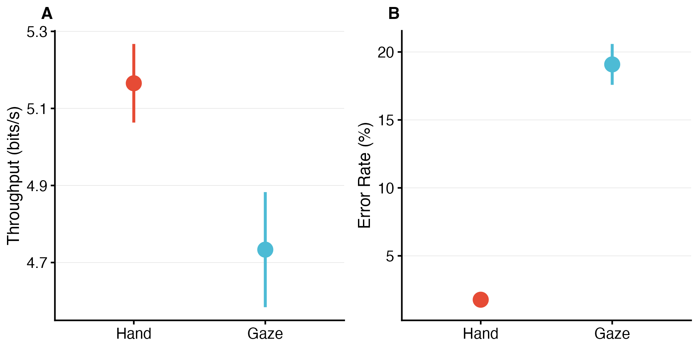

\vspace{-0.5em}

**Keywords:** Extended Reality, Adaptive Interfaces, Gaze Interaction, Fitts's Law, Multimodal Interaction, Gaze Simulation, Midas Touch, Linear Ballistic Accumulator, Intent Disambiguation

\newpage

# Introduction

XR interaction changes the control demands of pointing by moving input from desktop devices to embodied hand and gaze actions. Unlike the desktop metaphor, where interaction is mediated by low-effort devices like the mouse and keyboard, XR requires the user to engage their entire body; the primary pointing devices are the user's own hands and eyes. This embodied interaction is fraught with ergonomic and cognitive challenges. The "Gorilla Arm" syndrome, a phenomenon where prolonged mid-air arm extension leads to rapid musculoskeletal fatigue and pain, remains a critical barrier to the long-term adoption of gestural interfaces. Conversely, gaze-based interaction, which leverages the speed of the human oculomotor system, suffers from the "Midas Touch" problem—the inherent ambiguity between looking for perception and looking for action—and lacks the fine motor precision required for granular manipulation tasks [@jacob1990eye].

Current XR systems typically force a binary choice: the user must either commit to a controller-based paradigm, accepting the physical fatigue, or a gaze-based paradigm, accepting the lack of precision and the potential for inadvertent triggers. This rigid dichotomy ignores the dynamic nature of human attention and the varying demands of different tasks. A high-precision manipulation task may require the stability of a hand controller, while a rapid visual search task is best served by the saccadic speed of the eye.

To investigate whether adaptive support can alleviate these tradeoffs, we introduce the xr-adaptive-modality-2025 platform, a research framework for studying modality-specific adaptive support within hand and gaze input in XR-relevant pointing tasks. The system combines an ISO 9241-9 pointing task, physiologically informed gaze simulation, and modality-specific adaptive interventions intended to address distraction during gaze selection and spatial difficulty during hand selection. The central question is whether modality-specific adaptive support can improve performance and workload relative to static unimodal interaction [@soukoreff2004towards].

This paper makes three contributions. First, we present an **open-source platform** for controlled, reproducible study of gaze and hand pointing in XR-relevant tasks, including a physiologically informed gaze simulation, a policy-driven adaptation engine, and a full remote data collection infrastructure. Second, we provide **quantitative empirical evidence** on gaze vs. hand input in an ISO 9241-9 pointing task (N=69), showing that hand substantially outperforms gaze on throughput and error rate, and that the dominant failure modes are modality-specific: slips (false activations) for gaze and misses (spatial targeting failures) for hand. Third, we demonstrate that a simple **gaze-declutter adaptation** modestly reduces timeouts but does not address the core slip-based failure mode of gaze interaction, which has direct implications for designing modality-specific adaptive interventions. Unlike prior gaze+hand paradigms that treat the two modalities as complementary components of a fixed multimodal combination (e.g., gaze for acquisition + hand for confirmation [@jacob1990eye]), this work investigates *modality-specific adaptive support*—when and how the system should activate adaptations (declutter, width inflation) within each modality based on real-time performance signals. The platform could support future studies of modality switching.

The study is guided by three research questions. **RQ1 (Performance):** Does a context-aware adaptive system yield higher throughput ($TP$) than static unimodal systems? **RQ2 (Workload):** Can modality-specific adaptive interventions reduce "Physical Demand" and "Frustration" (NASA-TLX) compared to static conditions? **RQ3 (Adaptation):** Do adaptive interventions improve performance and reduce workload relative to static conditions? (In this dataset, only gaze declutter was evaluable; hand width inflation was not applied due to a UI integration bug.)

# Background and Related Work

## Sensorimotor Implications of Hand and Gaze Input

To design an effective adaptive system, one must first deconstruct the physiological mechanisms of the component modalities. Hand and gaze afford different control properties in XR: hand input supports precise corrective control, whereas gaze supports rapid orienting but introduces ambiguity when fixation is used for selection.

**Manual Pointing in XR:** Manual input in XR, whether through held controllers or optical hand tracking, mimics the act of physical pointing. This interaction style benefits from proprioception—the body's innate sense of limb position—which allows for high-precision corrections without visual attention. However, the biomechanical cost is substantial. In a 1:1 mapped XR environment, reaching a virtual object requires a corresponding physical motion. Frequent large-amplitude movements lead to fatigue in the deltoids and trapezius muscles. As fatigue sets in, the signal-to-noise ratio of the motor system degrades; the hand begins to tremor, increasing the effective target width required for accurate selection and reducing the overall throughput of the interaction.

**Gaze Interaction:** The eye is the fastest motor organ in the human body. Saccades—rapid, ballistic movements of the eye—can reach velocities exceeding 900 degrees per second [@bahill1979], making gaze an incredibly efficient modality for target acquisition. However, the eye is fundamentally an input organ, not an output device. Using gaze for selection introduces several critical issues: (1) **The Midas Touch**—in the physical world, we can look at an object without interacting with it, but in a gaze-controlled interface, looking becomes equivalent to touching, requiring "dwell time" mechanisms that slow interaction [@jacob1990eye]; (2) **Microsaccades and Jitter**—even when "fixated," the eye performs microsaccades to refresh the retinal image [@martinezconde2004], meaning a gaze cursor is inherently noisy, making selection of small targets frustrating without smoothing algorithms; (3) **Saccadic Suppression**—during rapid eye movements, the visual system suppresses input to prevent motion blur [@bridgeman1975], creating a "blind" phase that makes the initial phase of gaze targeting effectively open-loop.

## Signal Processing and Cognitive Load Framing

To study these dynamics with experimental rigor and reproducibility, our platform employs a **psychophysically-grounded generative simulation** of gaze behavior rather than raw sensor input or hardware eye-tracking. Unlike raw eye-tracker signals—which conflate device-specific artifacts with genuine oculomotor dynamics—this simulation provides explicit parametric control over the three physiological constraints most relevant to dwell-based selection: (1) **Sensor Lag**—a first-order lag (linear interpolation) mimics the processing latency (30–70 ms) typical of video-based eye trackers [@saunders2014]; (2) **Saccadic Blindness**—the cursor is frozen during high-velocity movements (>120 deg/s), simulating the lack of visual feedback during a saccade [@bridgeman1975]; (3) **Fixation Jitter**—Gaussian noise ($\sigma \approx$ 0.12°) is injected at low velocities to mimic fixational drift and microsaccade statistics [@martinezconde2004; @rolfs2009], ensuring that the cost of gaze interaction is accurately and reproducibly represented. Because each parameter is grounded in oculomotor literature, the simulation functions as a controlled analog of real eye-tracking rather than an arbitrary proxy (see @fig-psychophysics in Methods).

We use Cognitive Load Theory (CLT) as a conceptual lens for reasoning about modality-specific costs [@sweller1988]. CLT distinguishes intrinsic load (task difficulty) from extraneous load (interface overhead). In principle, hand input may increase physical effort (intrinsic load during larger reaches), whereas gaze input may increase extraneous attentional and verification demands during precise selection. The present study uses workload (NASA-TLX) and performance measures to test whether these modality-specific costs appear in the current task, and whether adaptive interventions can reduce them.

## Adaptive Intervention Mechanisms

We implemented two modality-specific adaptive interventions. **For gaze interaction**, a declutter mechanism draws on visual attention guiding techniques in XR, related to diminished reality (DR) [@herling2010]. When the policy engine detects performance degradation in gaze mode (error burst or RT threshold exceeded), non-critical HUD elements are hidden, mitigating peripheral distraction. This aligns with foveated rendering principles, where systems leverage the human visual system's foveal focus to prioritize content [@patney2016]. By decluttering when performance degrades, we hypothesize that gaze-based targeting becomes faster and less cognitively demanding.

**For hand-based interactions**, our adaptive strategy is width inflation—dynamically expanding the effective size of targets when performance degrades, triggered by the policy engine based on error rate and reaction time thresholds. This concept is inspired by "expanding targets" research [@mcguffin2005] and the "Bubble Cursor" [@grossman2005bubble], which demonstrate that even slight enlargement significantly improves pointing performance. Our implementation uses a hysteresis gate (requiring N consecutive trials meeting trigger conditions) to prevent flicker, acting as a "safety net" that compensates for motor tremor under fatigue.

## Differentiation from Prior Gaze+Hand Work

Recent XR systems combine gaze and hand in fixed multimodal combinations: gaze for target acquisition and hand for confirmation or manipulation [@pfeuffer2017gaze; @pfeuffer2024gaze]. Pfeuffer et al. [-@pfeuffer2024gaze] outline design principles for gaze+pinch interaction (e.g., division of labor, minimalistic timing), while Kim et al. [-@kim2025pinchcatcher] propose PinchCatcher, a semi-pinch quasi-mode for multi-selection in gaze+pinch interfaces. These approaches treat gaze and hand as complementary components of a fixed interaction paradigm. Our work differs by investigating *modality-specific adaptive support*—when and how the system should activate adaptations within each modality based on real-time performance signals—rather than a fixed multimodal combination. We draw on context-aware computing principles [@dey2001] to frame policy-driven adaptation that responds to performance degradation.

# Methods

The study was designed to support reproducible evaluation of modality-specific adaptive interventions under controlled remote testing conditions. The platform `xr-adaptive-modality-2025` serves as the technical apparatus for the study.

## Apparatus

We developed a custom pointing testbed as a web-based application (React 18, TypeScript), allowing broad hardware compatibility for remote participants. The study was conducted on participants' own computers using a standard mouse or trackpad. No headset or VR hardware was used; the platform serves as a controlled web-based proxy for XR-relevant selection dynamics.

### Display Calibration and Reliability Measures

To ensure measurement validity across heterogeneous display configurations, we implemented a multi-layered approach addressing display variability. Before commencing experimental trials, participants completed a Credit Card Calibration procedure: participants placed a standard credit card (85.60 mm × 53.98 mm) on their screen and adjusted an on-screen rectangle to match its physical dimensions. This calibration enabled computation of pixels per millimeter (px/mm) and pixels per degree of visual angle (PPD), normalizing gaze simulation jitter to screen-space pixels and ensuring consistent perceptual difficulty across different display sizes and resolutions [@mackenzie1992fitts].

To minimize measurement error, we enforced strict display requirements: fullscreen/maximized window (required before starting blocks), browser zoom locked to 100% (verified before each block using `window.visualViewport.scale`), and live monitoring during trials (trials automatically paused if settings changed). For every trial, we logged comprehensive display metadata: device pixel ratio (DPR), browser type, viewport dimensions, zoom level, fullscreen status, and tab visibility duration. Trials were excluded from analysis if zoom level $\neq$ 100%, fullscreen status = FALSE, DPR instability (change \> 0.1 between blocks), or tab hidden for \> 500ms. Participants with \> 40% of trials excluded due to display violations were removed from the final analysis.

### Gaze Simulation

To ensure rigorous internal validity and precise control over noise characteristics, we utilized a Physiologically-Accurate Gaze Simulation. The simulation models the specific constraints of eye-tracking interaction—latency and jitter—with explicit parametric control. The simulation transformed raw mouse input into "gaze" coordinates via three mechanisms derived from oculomotor physiology:

1.  **Saccadic Suppression & Ballistic Movement:** The cursor was "frozen" (blind) during high-velocity movements (\>120 deg/s) to simulate the brain's suppression of visual input during saccades, a phenomenon known as saccadic suppression of image displacement [@bridgeman1975]. This aligns with the ballistic nature of saccadic eye movements, where visual feedback is effectively open-loop until the eye settles.

2.  **Fixation Jitter & Drift:** When the cursor slowed (\<30 deg/s), Gaussian noise (SD $\approx$ 0.12$^\circ$ visual angle) was injected to simulate fixational eye movements [@martinezconde2004], specifically the random walk characteristics of ocular drift and tremor that occur even during attempted fixation. This angular noise was normalized to screen pixels using the pixels-per-degree (PPD) calibration value, ensuring consistent perceptual difficulty across different display sizes and viewing distances.

3.  **Sensor Lag:** A first-order lag (linear interpolation, factor 0.15) was applied to mimic the processing latency (typically 30–70 ms) inherent in video-based eye trackers [@saunders2014].

Each parameter was chosen to match published oculomotor norms, making the simulation a psychophysically-grounded proxy for eye-tracking rather than arbitrary noise injection. The 120 deg/s saccade-detection threshold lies well above the velocity range of fixation and smooth pursuit (<30 deg/s) and below the peak velocities of medium-to-large saccades (>300 deg/s), consistent with established velocity-based saccade classification criteria [@engbert2003; @bahill1979]. During saccades in this velocity range, the visual system suppresses sensitivity by up to 50–80% of baseline, preventing perceptual blur from rapid retinal image displacement [@bridgeman1975]. The fixation jitter magnitude ($\sigma \approx$ 0.12°) falls within the documented amplitude range of human microsaccades—the involuntary fixational eye movements responsible for the dominant source of spatial noise at a gaze cursor—which span 0.1–0.5° in the literature [@martinezconde2004; @rolfs2009]. Applied independently per axis per frame, this produces a spatial random walk consistent with the statistical characteristics of fixational drift and tremor. The sensor lag (lerp $\alpha$ = 0.15 at 60 Hz) produces an effective smoothing time constant of approximately 100 ms, encompassing the hardware plus software latency range documented for commercial video-based eye trackers [@saunders2014]. @fig-psychophysics illustrates the full pipeline, the behavioral output of each stage, and the selection tolerance model.

![Psychophysically-grounded gaze proxy pipeline. Panel A (left): The three-stage simulation: raw mouse input is differentiated to estimate angular velocity; velocity above 120 deg/s triggers saccadic suppression (cursor freezes, then jumps to new position); velocity below 30 deg/s triggers the fixation transform (Gaussian jitter $\sigma \approx$ 0.5 mm + first-order lag smoothing). Panel B (center): Output signal examples—fixation mode (B1) produces continuous spatial noise consistent with microsaccade statistics; saccade mode (B2) produces a cursor freeze and ballistic jump, reproducing the perceptual blind phase of real saccades. Panel C (right): The selection model, with a dwell-confirm tolerance ring (target radius + 10 px) that accommodates fixation jitter while keeping sensitivity well-defined.](../assets/case_study/psychophysics.png){#fig-psychophysics width=100%}

## Input Modality Implementations

The system implemented two distinct input modalities, each with static and adaptive modes. **For hand-based trials**, participants controlled a cursor with their mouse to click the target. In static mode, this was standard 1:1 mouse pointing. In adaptive mode, the system was designed to expand the effective clickable area of targets (width scale \> 1.0) through a rule-based policy engine that triggers when performance degrades (error burst $\geq$ 2 consecutive errors or reaction time exceeds the 75th percentile threshold), drawing on the "expanding targets" technique [@mcguffin2005]. In this dataset, the hand width-inflation pathway was not evaluable: width scaling remained at 1.0 across trials, and although the policy engine emitted inflate-width actions in some sessions, the rendered targets were not updated.

**For gaze-based trials**, participants controlled the cursor via the simulated gaze signal described above. In the analyzed dataset, gaze selection used 500 ms dwell-to-select: the cursor had to remain within the target for 500 ms to trigger selection automatically. Space key confirmation (dwell disabled) was not used. This follows the standard "dwell-to-select" paradigm [@ware1987; @majaranta2006]. In adaptive mode, the system implements a *declutter mechanism* that hides non-critical HUD elements when the policy engine detects performance degradation (error burst or RT threshold exceeded) in gaze blocks. The declutter effect persists until performance improves, using hysteresis to prevent rapid oscillation.

Both adaptive features (declutter and width expansion) are driven by a rule-based policy engine with hysteresis gates (requiring N consecutive trials meeting trigger conditions) to prevent flicker. The application logged detailed event traces (policy state changes, trial performance, adaptation triggers) to enable verification of adaptive mechanism activation and effectiveness.

## Task and Stimuli

Participants performed a multi-directional pointing task conforming to the ISO 9241-9 standard for non-keyboard input device evaluation [@iso2000]. Targets were arranged in a circular layout with 8 positions (width $W$, amplitude $A$), with one target highlighted at a time. Targets were presented with IDs ranging from approximately 2 to 6 bits, calculated using the Shannon formulation of Fitts' Law (target width ranged from 30 px to 80 px, with corresponding distances chosen to yield the desired ID values). In half of the blocks, a "Time Pressure" condition was enforced via a visible countdown timer; failure to select within the timeout (6s) resulted in a forced error, intended to induce stress and mental workload, simulating a high-demand scenario. @fig-task-layout shows the task interface.

{#fig-task-layout width=100%}

## Experimental Design

We employed a repeated-measures factorial design: all participants experienced every combination of the two input modalities (Gaze vs. Hand) × two UI conditions (Adaptive vs. Non-adaptive) × two workload levels (Pressure vs. No Pressure). This creates a 2 × 2 × 2 within-subjects design.

### Counterbalancing: The Williams Design

The order of modality blocks was counterbalanced using a Williams Latin square arrangement to control for learning effects [@williams1949experimental]. Static and adaptive conditions were run as **separate blocks**; each block corresponded to one Modality × UI Mode × Pressure combination (e.g., Hand-Static-Self-Paced, Gaze-Adaptive-Time-Limited). Within each block, all trials shared the same modality, UI mode, and pressure level. Participants were not explicitly told when the system was adapting, aside from noticing the visual changes, to reduce expectancy biases.

## Participants

### Sample Size and Recruitment

A total of 81 participants enrolled and completed the task. After applying the inclusion criteria, study's trial-validity, and factorial-completeness criteria, 69 participants were retained for the primary analysis. The retained sample had a mean age of 30.0 years (SD = 7.5; range = 18–62) and included 39 men and 30 women. Most participants were right-handed (91.3%), and all retained participants completed the hand condition using a mouse with the right hand. Participants reported no motor impairments. This study was conducted as an independent personal research project and was not reviewed by an institutional review board. Participants provided informed consent electronically through the web application before participation.

## Procedure

Each participant completed a short training session to get familiar with gaze selection (including practice with the simulated gaze interface and dwell clicking) and hand selection. During the experiment, they performed 8 blocks of 27 trials each (216 main-task trials per participant before trial-level exclusions). Practice trials were excluded from analysis. Target positions cycled through 8 directions; Index of Difficulty varied across three levels ($\approx$ 2--6 bits). Pressure (time-limited vs. self-paced) was assigned at the block level.

After each block, participants filled out a NASA-TLX workload survey (rating mental demand, physical demand, etc.) and took a short break to mitigate fatigue. The entire session lasted about 1 hour per participant.

## Measures and Analysis Strategy

The primary performance measures were Movement Time (MT) in milliseconds (from trial start to successful selection) and Selection Accuracy (hit vs. miss rate, including specific error types). We classified errors into three categories following Reason's [-@reason1990] taxonomy of human error: **slips** (unintended activations—the cursor dwelled on a target the user did not intend to select), **misses** (failures of spatial targeting—the user attempted selection but did not acquire the target within bounds), and **timeouts** (no response within the 6-second trial window). The main text emphasizes descriptive estimates and 95% confidence intervals.

### Throughput and Fitts-Style Performance Metrics

We adopted the Shannon formulation of Fitts’s Law [@soukoreff2004towards], the standard form used for ISO 9241-9 compliance: $ID = \log_2(D/W + 1)$, where $D$ is target distance and $W$ is target width. Movement time was modeled as $MT = a + b \cdot ID$, where $a$ is the intercept and $b$ reflects the movement-time cost per additional bit of difficulty; smaller slopes therefore imply greater information-processing efficiency. To account for endpoint variability, we used Effective Width ($W_e$), computed from the distribution of selection endpoints as $W_e = 4.133 \sigma_x$, where $\sigma_x$ is the standard deviation of endpoint error projected onto the task axis. This ISO-based correction yields an effective index of difficulty ($ID_e$) and allows Throughput ($TP = ID_e / MT$) to serve as a unified measure of speed–accuracy performance. We also logged velocity profiles and submovement counts for control-theoretic analysis [@meyer1988], although those measures are not the focus of the present report.

### Verification-Phase Modeling with LBA

To better understand behavior after the pointer first entered the target, we modeled the verification phase—the interval between first target entry and final selection—as a latent decision process. This phase is intended to capture the extra time users may spend confirming that the correct target has been acquired before committing to selection. We used the **Linear Ballistic Accumulator (LBA)** model [@brown2008], a race model in which evidence for competing responses increases linearly until one reaches threshold. In behavioral terms: **drift rate** reflects how quickly and how well evidence accumulates that the target acquisition is correct; **threshold** reflects how much evidence is required before committing to selection; and **$t_0$** is a verification-related latent offset capturing residual non-accumulation time.

In our fitted parameterization, $t_0$ is reported on a latent scale rather than as a directly observed millisecond quantity, so condition differences in $t_0$ are interpreted directionally and in conjunction with the empirical verification-phase RT summaries. We chose LBA rather than a Drift Diffusion Model because these data come from a low-error pointing task, a setting in which LBA is often more stable and interpretable than diffusion-based approaches [@lerche2017]. We fit a hierarchical Bayesian LBA model in PyMC with modality- and UI-mode-varying $t_0$, ID-varying drift rate, and pressure-varying threshold, using verification-phase RTs from valid trials (200–5000 ms).

## Deployment and Data Collection Infrastructure

The experimental platform was deployed as a web application (React 18, TypeScript, Vite) hosted on Vercel (https://xr-adaptive-modality-2025.vercel.app) to enable remote, asynchronous data collection. Each participant received a unique URL containing embedded participant ID. The application automatically detected these parameters on load, initializing the session with the appropriate identifier. Session state was managed client-side using browser localStorage, enabling participants to pause and resume sessions while maintaining progress tracking.

Data collection occurred entirely client-side to ensure participant privacy. The application implemented a structured CSV logging system that captured comprehensive trial-level data in real-time (77 columns per trial), including participant metadata (ID, demographics, session number), trial parameters (block, trial, modality, UI mode, pressure, ID, A, W), performance metrics (RT, accuracy, error type, hover duration, submovement count, verification time), adaptive system metrics (width scaling, alignment gate metrics, adaptation triggers), system metadata (browser type, DPR, display calibration, timestamp), and workload measures (NASA-TLX subscales). At the completion of each session, participants exported their data via browser-based CSV download. Data export occurred entirely locally—no data was transmitted to servers during the experimental session, ensuring participant privacy. The application was built as a single-page application (SPA) with client-side routing, with the gaze simulation algorithm, adaptive policy engine, and data logging system all operating in real-time within the browser. Event-driven architecture (via an internal event bus) coordinated trial timing, data logging, and UI updates, ensuring precise temporal alignment between user actions and recorded data.

**Data Quality Assurance:** A post-collection audit verified modality and UI mode logging and identified a pressure-condition logging issue that affected early sessions. The bug was corrected in the codebase; all analyses use the corrected merged dataset. The primary participant exclusion criterion is 8-block factorial completeness. All code is open-source and available for reproducibility.

# Results

We report results from N=69 participants with complete factorial data (15,105 trials after QC and device filter; 13,519 valid for performance metrics).

## Primary Performance Outcomes (RQ1)

Throughput (TP), error rate, and movement time (MT) were computed following ISO 9241-9. @tbl-performance reports descriptive statistics by modality, collapsed over UI mode and pressure.

::: {#tbl-performance}
| Metric | Hand | Gaze |
|:-------|:----:|:----:|
| Throughput (bits/s) | 5.17 [5.06, 5.27] | 4.73 [4.58, 4.88] |
| Error Rate (%) | 1.77 [1.22, 2.32] | 19.09 [17.58, 20.59] |
| Movement Time (s) | 1.09 [1.07, 1.11] | 1.19 [1.14, 1.23] |

: Primary performance metrics by modality. Values are mean [95% CI]. Hand produced higher throughput and lower error rate than gaze.
:::

Hand input yielded higher throughput (5.17 vs. 4.73 bits/s) and substantially lower error rate (1.8% vs. 19.1%) than gaze input. Movement time was shorter for hand (1.09 s) than gaze (1.19 s). Hand outperformed gaze on all three metrics. @fig-performance illustrates these differences.

{#fig-performance width=85%}

## Error Profile: Midas Touch Signature

Error types differed sharply between modalities (@tbl-error-types). For **gaze**, 99.2% of errors were **slips** (accidental activations) and 0.8% were timeouts. For **hand**, 95.7% were **misses** (target not acquired) and 4.3% were timeouts. This asymmetry is consistent with the Midas Touch account [@jacob1990eye]: gaze interaction failed primarily due to intent ambiguity (looking to see vs. looking to select), whereas hand interaction failed due to spatial targeting errors.

::: {#tbl-error-types}
| Error Type | Hand | Gaze |
|:-----------|:----:|:----:|
| Slip (accidental activation) | 0% | 99.2% |
| Miss (target not acquired) | 95.7% | 0% |
| Timeout | 4.3% | 0.8% |

: Distribution of error types by modality. Gaze errors are predominantly slips; hand errors are predominantly misses.
:::

@fig-error-types shows the composition of errors by modality, illustrating the stark contrast between gaze (slips) and hand (misses).

{#fig-error-types width=75%}

## Gaze Declutter Effectiveness (RQ3)

The gaze adaptive manipulation (declutter) was the only adaptation that executed in this dataset. Gaze error rate was modestly lower in adaptive (18.2%) than static (19.1%) mode. The declutter mechanism reduced timeouts (1.18% → 0.42%) but did not materially reduce slips (98.8% → 99.6%). Hand width inflation was not evaluable in the present dataset (width scaling remained at 1.0; see Appendix). The declutter effect was modest.

## Subjective Workload (RQ2)

NASA-TLX scores (0–100) were higher for gaze than hand across all subscales (@tbl-tlx). Overall workload (unweighted mean of six subscales) was 38.9 [35.3, 42.5] for hand and 46.4 [42.8, 50.0] for gaze. For the RQ2-specified subscales, **Physical Demand** was 33.2 [29.4, 37.0] (hand) vs. 41.1 [37.1, 45.0] (gaze), and **Frustration** was 31.4 [27.5, 35.4] (hand) vs. 43.6 [39.6, 47.7] (gaze).

::: {#tbl-tlx}
| NASA-TLX Subscale | Hand | Gaze |
|:------------------|:----:|:----:|
| Mental Demand | 33.8 [30.1, 37.4] | 45.1 [41.4, 48.9] |
| Physical Demand | 33.2 [29.4, 37.0] | 41.1 [37.1, 45.0] |
| Temporal Demand | 38.9 [35.3, 42.5] | 46.5 [43.1, 50.0] |
| Performance | 54.3 [48.6, 59.9] | 52.7 [48.4, 57.0] |
| Effort | 38.3 [34.4, 42.3] | 47.1 [43.3, 51.0] |
| Frustration | 31.4 [27.5, 35.4] | 43.6 [39.6, 47.7] |
| **Overall** | **38.9 [35.3, 42.5]** | **46.4 [42.8, 50.0]** |

: NASA-TLX subscale means [95% CI] by modality. Higher = more workload.
:::

@fig-tlx shows overall workload by modality. @fig-tlx-subscales compares workload across the six NASA-TLX subscales, making it clear which dimensions (e.g., Physical Demand, Frustration) differ most between hand and gaze.

{#fig-tlx width=70%}

{#fig-tlx-subscales width=75%}

## LBA Cognitive Modeling

@tbl-lba-params reports group-level LBA parameter estimates by modality and UI mode. In the fitted model, the primary condition-sensitive parameter was $t_0$; drift base, the ID-related drift slope, and the pressure-related threshold slope were modeled as shared effects and therefore do not vary across modality × UI rows in @tbl-lba-params. The non-decision-time parameter ($t_0$) is reported on the model's latent scale, not as a raw duration in milliseconds. More rightward (less negative) values indicate a larger verification-related offset under the fitted parameterization. @fig-lba-t0 visualizes the $t_0$ posterior estimates and 95% HDIs by condition; gaze conditions show higher (less negative) $t_0$ values than hand conditions, consistent with longer verification-phase duration in the empirical data. @fig-verification-rt shows the empirical verification-phase RT by condition; the condition ordering matches the latent $t_0$ ordering.

### Parameter Estimates

::: {#tbl-lba-params tbl-colwidths="[20,22,12,22,24]"}
| Condition | $t_0$ (latent) [95% HDI] | Drift Base | ID Slope [95% HDI] | Pressure [95% HDI] |
|:----------|:---------------------:|:----------:|:------------------:|:------------------:|
| Hand – Static | −2.85 [−3.46, −2.24] | 5.03 | −0.93 [−0.95, −0.92] | 0.06 [0.03, 0.09] |
| Hand – Adaptive | −3.01 [−3.64, −2.42] | 5.03 | −0.93 [−0.95, −0.92] | 0.06 [0.03, 0.09] |
| Gaze – Static | −1.41 [−1.87, −1.00] | 5.03 | −0.93 [−0.95, −0.92] | 0.06 [0.03, 0.09] |
| Gaze – Adaptive | −0.97 [−1.39, −0.57] | 5.03 | −0.93 [−0.95, −0.92] | 0.06 [0.03, 0.09] |

: LBA parameter estimates by modality and UI mode. Point estimates with 95% highest-density intervals. $t_0$ (latent): verification-related offset on the model's latent scale; values are not in milliseconds. More rightward (less negative) values indicate longer verification-phase duration under the fitted parameterization. ID slope: effect of difficulty on drift (negative = harder trials reduce drift). Pressure slope: effect of time pressure on threshold. Drift base and threshold intercept shared across conditions.
:::

![Non-decision time ($t_0$) by condition. Each row shows one condition; the point is the posterior mean and the horizontal line is the 95% highest-density interval. $t_0$ is shown on the model's latent scale, not in raw milliseconds. More rightward (less negative) values correspond to a larger verification-related offset under the fitted parameterization. Gaze conditions (top two rows) show longer verification-related offsets than hand conditions (bottom two rows), consistent with the empirical verification-phase RT and the Midas Touch account.](../assets/case_study/lba_t0_forest.png){#fig-lba-t0 width=90%}

{#fig-verification-rt width=85%}

### Interpretation

**Modality effect on $t_0$:** Gaze conditions show higher $t_0$ values (less negative: −1.41 to −0.97) than hand conditions (−3.01 to −2.85) on the latent scale, consistent with a longer verification-phase duration for gaze interaction. This ordering aligns with the empirical verification-phase RT (@fig-verification-rt). The pattern is compatible with the Midas Touch account: gaze may require additional time for intent disambiguation before selection.

**UI mode effect:** Adaptive UI shows different $t_0$ patterns, particularly for gaze (static: −1.41, adaptive: −0.97). The higher $t_0$ in gaze-adaptive may reflect altered verification timing under declutter, though the direction warrants further investigation.

**Difficulty and pressure:** The shared effects capture general task dynamics. The negative ID-related drift slope (−0.93) indicates that greater task difficulty reduces evidence-accumulation efficiency (consistent with Fitts's Law). The positive pressure-related threshold slope (0.06) indicates that time pressure alters response caution—the amount of evidence required before committing—rather than evidence quality. The main modality difference remains concentrated in $t_0$.

### Convergence Diagnostics

MCMC convergence was satisfactory: R-hat remained at 1.0 for all parameters, and ESS exceeded 2,000. The drift-rate slope (ID) and threshold slope (pressure) exhibited unimodal posteriors and well-mixed chains. Non-decision time showed multiple modes across the four condition cells, reflecting the hierarchical structure. Trace plots are provided in the Appendix (@fig-lba-trace).

# Discussion

The results suggest a clear modality asymmetry in XR pointing performance. Across the primary performance measures, hand input outperformed gaze input: hand produced higher throughput (5.17 vs. 4.73 bits/s), lower error (1.8% vs. 19.1%), and shorter movement time (1.09 vs. 1.19 s). The workload pattern paralleled these performance differences. NASA-TLX scores were higher for gaze than hand overall (46.4 vs. 38.9), with especially notable differences in Physical Demand (41.1 vs. 33.2) and Frustration (43.6 vs. 31.4). Taken together, these findings address RQ1 and RQ2 in a consistent direction: under the present task and simulation conditions, gaze interaction was not merely less accurate than hand input, but also experienced as more effortful.

The most informative result is not only that gaze performed worse, but how it failed. Gaze errors were overwhelmingly slips (99.2%), whereas hand errors were overwhelmingly misses (95.7%). This asymmetry is important because it distinguishes two different failure regimes. Hand failures reflected spatial targeting difficulty: users attempted the correct action but failed to acquire the target. Gaze failures instead reflected intent ambiguity: the system registered activation when users were looking, but not necessarily intending to select. This pattern is directly consistent with the Midas Touch account proposed by Jacob [-@jacob1990eye]. In that sense, the present dataset contributes more than another hand-versus-gaze comparison. It shows that the principal liability of gaze in this XR task was not generic imprecision alone, but the coupling of visual attention and command execution.

These findings also fit the information-theoretic interpretation of pointing performance formalized by Fitts's Law [@soukoreff2004towards]. Throughput reflects the effective rate at which a user can resolve spatial uncertainty, expressed in bits per second. On that metric, hand preserved a higher information-processing rate than gaze in the current task. The appendix-level Fitts validation supports this interpretation: hand showed stronger fits and more stable scaling with index of difficulty, whereas gaze exhibited weaker fits and lower explained variance. Although both modalities were affected by task difficulty, the steeper and noisier gaze fits suggest that its performance was shaped by more than ballistic movement alone. In other words, increasing difficulty did not simply elongate transport time; it also appears to have amplified downstream verification demands.

The cognitive modeling results sharpen that interpretation. In the LBA analysis, gaze showed a larger verification-related latent offset than hand ($t_0$ on the model's latent scale), indicating a longer pre- or post-decisional component surrounding overt selection [@brown2008]. This ordering was consistent with the empirical verification-phase RT. In the present task, the most plausible interpretation is that gaze required a longer verification phase before commitment. That is exactly where a Midas Touch problem should appear: not necessarily in the initial orientation toward a target, but in the added delay needed to decide whether fixation is sufficiently stable, intentional, and safe to confirm. The negative ID slope for drift rate (−0.93) is also consistent with a Fitts-like account in which harder trials reduce the rate of evidence accumulation. The positive pressure slope (0.06) further suggests that time pressure altered the caution policy rather than simply speeding responses, which is consistent with a speed–accuracy tradeoff account. Taken together, the LBA results indicate that gaze interaction imposed a verification burden beyond raw target acquisition. Because the condition-varying effect was concentrated in $t_0$, the modality difference in this dataset appears to reflect a verification burden more than a broad change in evidence quality or response caution.

This pattern can also be understood through the lens of cognitive load. In principle, gaze offers a low-effort means of orienting to targets, while hand input incurs greater bodily effort, especially in spatial interfaces often associated with "Gorilla Arm" fatigue. Yet the present workload results suggest that, in this task, gaze introduced greater extraneous load than hand. That load likely came from the need to monitor cursor stability, manage dwell or confirmation timing, and suppress unintended selections. Hand input, by contrast, appears to have shifted the burden toward controlled spatial targeting, but in a way that remained more manageable under the current task constraints. In that sense, the gaze–hand tradeoff is not well captured by a simple speed-versus-fatigue dichotomy. Rather, gaze may reduce some motor demands while increasing decisional and attentional overhead; hand may require more overt motor control while preserving clearer action intention and lower ambiguity. The workload findings are consistent with that framing, particularly the elevated Frustration scores under gaze.

RQ3 received only partial support in this dataset. The only adaptive mechanism that actually executed was gaze declutter, and its benefit was modest. Gaze error declined directionally from 19.1% in the static condition to 18.2% in the adaptive condition. More specifically, declutter reduced timeouts from 1.18% to 0.42%, but did not reduce slips; slips remained dominant and even slightly increased proportionally (98.8% to 99.6%). This pattern suggests that declutter may have helped with distraction-driven hesitation or delayed commitment, but it did not address the core failure mode of gaze interaction, namely intent disambiguation. That distinction matters: if the main problem is that users accidentally activate while looking, reducing peripheral clutter may improve attentional focus without solving the actual selection ambiguity. By contrast, the hand width-inflation mechanism was not evaluable in the present dataset (width scaling remained at 1.0; the policy engine emitted actions in some sessions but the UI did not apply them to rendered targets). RQ3 is only partially answered given that hand width inflation was not evaluable.

The present findings are broadly aligned with prior work showing both the promise and fragility of gaze-based interaction in multimodal systems. Prior gaze+hand paradigms have often treated gaze as an efficient means of target acquisition and the hand as a confirmation or refinement channel, thereby exploiting the complementary strengths of the two modalities [@pfeuffer2017gaze]. That general logic is compatible with the current results: gaze appears efficient for orienting attention, but unreliable as a sole selection mechanism when intent must be inferred from fixation. Likewise, the width-inflation mechanism draws conceptually on expanding-target and Bubble Cursor work, which has repeatedly shown that increasing effective target size can improve pointing performance under uncertainty [@mcguffin2005; @grossman2005bubble]. A key contribution of the present platform is the integration of physiologically constrained gaze simulation, an ISO 9241-9 task structure, and policy-driven modality-specific adaptive interventions within one reproducible framework. That combination makes it possible to study modality-specific failure modes under controlled conditions rather than treating gaze and hand as interchangeable input channels.

The design implications are practical. For XR designers, the current evidence suggests that hand input remains the more reliable option for precise selection tasks in which slips are costly. Gaze may still be valuable for rapid orienting, scanning, or coarse target acquisition, but only when paired with a mechanism that resolves intent ambiguity. Declutter may help when performance degradation is driven by visual competition or hesitation, but it is unlikely to solve Midas Touch on its own. More generally, adaptive systems in XR should not be judged only by whether adaptation occurred, but by whether the adaptation targets the dominant failure mode of the modality. @tbl-design-implications summarizes these modality-specific guidelines.

::: {#tbl-design-implications}
| Modality | Dominant Failure Mode | Recommended Adaptation |
|:---------|:----------------------|:------------------------|
| Gaze | Slips (unintended activation) | Declutter for distraction-driven hesitation; intent disambiguation (dwell, confirmation) for core Midas Touch |
| Hand | Misses (spatial targeting) | Width inflation / target expansion for acquisition difficulty |

: Design implications: modality-specific failure modes and recommended adaptive interventions.
:::

Several limitations qualify these conclusions. First, the sample comprised N=69 participants with complete factorial data. Second, gaze was implemented via a psychophysically-grounded simulation rather than hardware eye-tracking (see @fig-psychophysics). This is a deliberate methodological strength: parametric control over saccadic suppression, fixation jitter, and sensor lag—each calibrated to published oculomotor norms—provides reproducibility and internal validity that hardware trackers cannot offer, since real systems confound device-specific artifacts (calibration drift, illumination variability, blink events) with genuine oculomotor signals. The constraint of the simulation is scope, not accuracy: it models the three psychophysical mechanisms most relevant to dwell-based selection, but does not replicate the full noise profile of a specific eye-tracker model. Whether the modality asymmetries documented here—particularly the slip-dominated gaze error profile—persist under these additional noise sources is an empirical question for follow-up work with hardware eye-tracking. Third, the hand adaptation pathway was not evaluable (width inflation did not affect rendered targets), leaving RQ3 only partially answered. Fourth, a pressure-logging bug affected early data collection; the primary exclusion criterion is 8-block factorial completeness. Fifth, the study used a desktop web proxy (mouse/trackpad); generalization to headset-based XR with optical hand tracking or hardware eye-tracking requires validation. Finally, the task was restricted to an ISO 9241-9 multidirectional tapping paradigm, which captures one well-defined class of XR interaction but cannot fully represent more ecological tasks such as menu navigation, object manipulation, or extended mixed-modality workflows.

These limitations point to directions for future work. Validation with real eye-tracking hardware could determine whether the present gaze-specific costs persist under actual ocular input. Expansion of the adaptive design space—for example, dynamic dwell policies, goal-aware snapping, or hybrid confirmation schemes—could target intent disambiguation more directly. The hand pathway should be evaluated under conditions where width inflation activates reliably. Broader task ecologies are needed: modality-specific adaptive systems will be most compelling if they generalize beyond canonical tapping tasks to the mixed attentional and motor demands that define real XR work.

# Conclusion

This paper introduced the xr-adaptive-modality-2025 platform as a rigorous and reproducible framework for studying gaze and hand pointing and modality-specific adaptive interventions in XR-relevant tasks. The platform combines an ISO 9241-9 multidirectional tapping task, physiologically informed gaze simulation, and policy-driven adaptive interventions intended to respond to modality-specific performance degradation. As a research framework, it is designed not only to compare gaze and hand input, but to examine when and why adaptation helps.

The findings from the factorial dataset (N=69) suggest a consistent pattern. Hand input yielded higher throughput and lower error than gaze input, and gaze imposed higher subjective workload across NASA-TLX dimensions. The strongest empirical result was the error-type asymmetry: gaze errors were almost entirely slips, whereas hand errors were overwhelmingly misses. That pattern is consistent with the Midas Touch problem [@jacob1990eye] and indicates that gaze failure in this task was driven primarily by intent ambiguity rather than by timeout-based hesitation alone. The only adaptive mechanism that executed—gaze declutter—showed modest directional benefit by reducing timeouts, but did not reduce slips. The hand width-inflation mechanism was not evaluable in this dataset.

For XR designers, the practical implication is straightforward: adaptive systems should be built around modality-specific failure modes rather than generic adaptation logic. Declutter may help when gaze performance degrades due to distraction, while target expansion may be more appropriate for hand-based spatial difficulty, but both require evaluation under the conditions that actually trigger them. Adaptive multimodal XR interfaces will likely be most effective when they treat gaze and hand as distinct channels with distinct ergonomic and cognitive constraints.

# Code and Materials Availability

Code, analysis scripts, and documentation are available at https://github.com/mohdasti/xr-adaptive-modality-2025. The repository includes the experimental platform (React/TypeScript), R and Python analysis pipelines, preregistration documents, and data dictionaries. Aggregated results are available via Zenodo (DOI: 10.5281/zenodo.18204915). The live deployment used for data collection is hosted at https://xr-adaptive-modality-2025.vercel.app.

# Acknowledgments

This research was conducted as an independent project. The authors thank the participants for their time and the open-source community for the tools that made this work possible.

# Appendix

## Fitts' Law Regression (Validation)

Linear regression of movement time on effective Index of Difficulty ($ID_e$) validates that the task conforms to Fitts's Law. @tbl-fitts reports slope ($b$) and $R^2$ by modality and UI mode. Hand conditions showed smaller slopes (0.15–0.16 s/bit) and higher $R^2$ (0.54) than gaze (slopes 0.18–0.19 s/bit, $R^2$ 0.25–0.35). The steeper gaze slope suggests that difficulty primarily affects the verification phase rather than the initial ballistic phase, aligning with the LBA latent-offset results.

::: {#tbl-fitts}
| Condition | Slope (s/bit) | $R^2$ |
|:----------|:-------------:|:-----:|
| Hand – Static | 0.155 | 0.54 |
| Hand – Adaptive | 0.146 | 0.54 |
| Gaze – Static | 0.179 | 0.35 |
| Gaze – Adaptive | 0.19 | 0.25 |

: Fitts' Law regression (MT ~ $ID_e$) by condition. Slope = movement-time cost per bit (smaller = higher efficiency); $R^2$ = proportion of variance explained.
:::

@fig-fitts shows the regression of movement time on effective Index of Difficulty by modality.

{#fig-fitts width=95%}

## LBA MCMC Trace Plots

{#fig-lba-trace width=90%}

## Adaptive System Manipulation Check

Hand width inflation did not activate in this dataset. Across all trials, `width_scale_factor` remained 1.0 (0 trials with scaling). The PolicyEngine emitted `inflate_width` actions in some sessions, but the UI integration did not apply them to rendered targets. Consequently, hand UI-mode effects cannot be interpreted as adaptation effectiveness; only gaze declutter was evaluable. Full diagnostic analysis is available in the project repository.

# References

::: {#refs}
:::